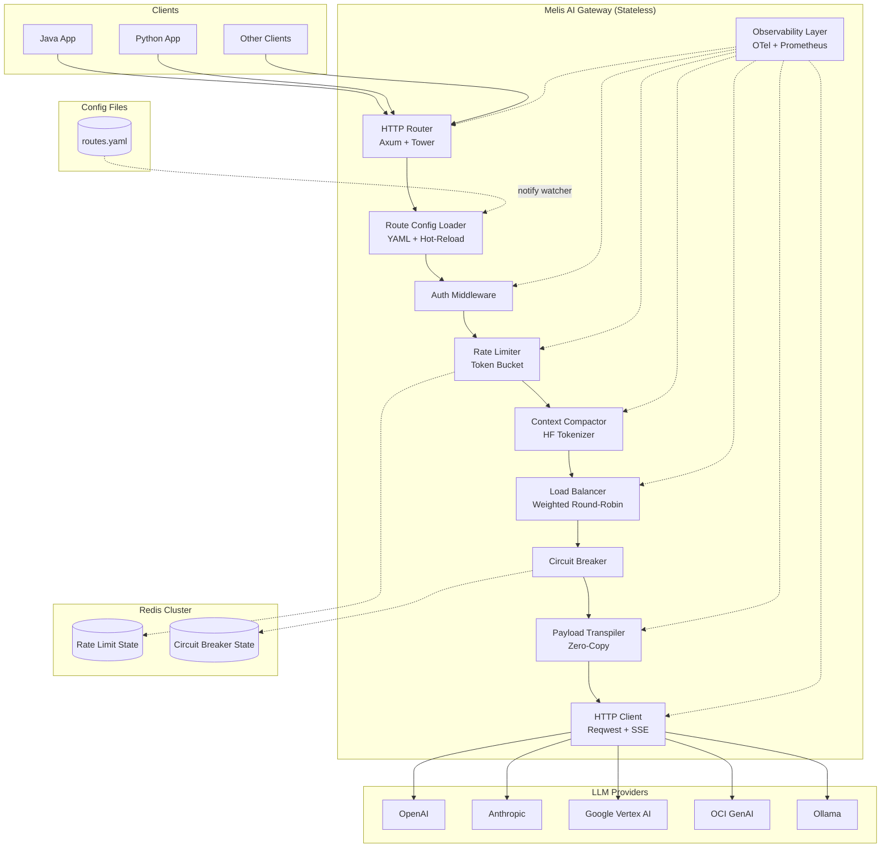
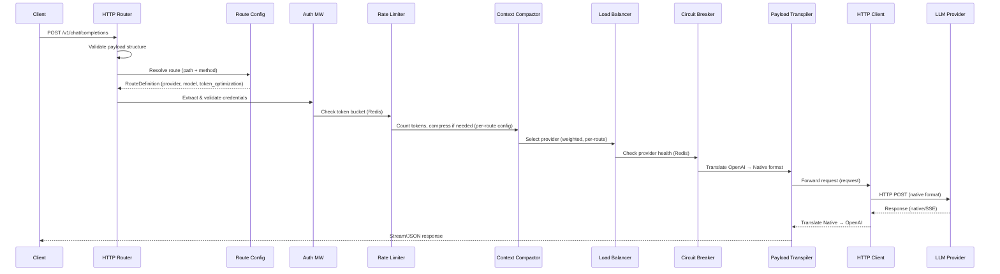
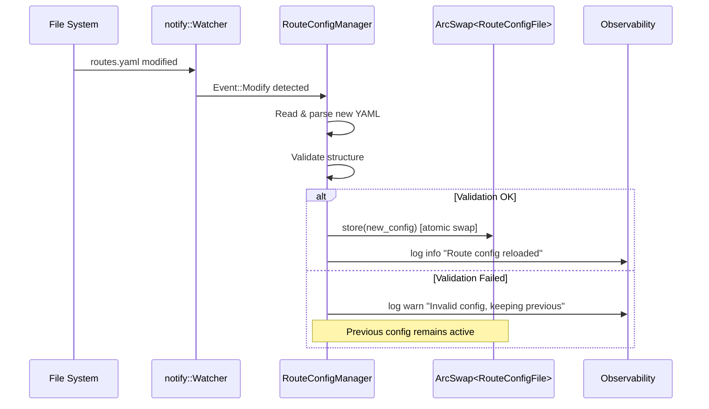
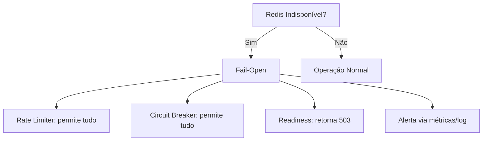

# Design Document: Melis AI Gateway

## Overview

O Melis AI Gateway é um proxy reverso stateless de ultra-alta performance, implementado em Rust com o framework Axum e runtime Tokio, que atua como camada de infraestrutura entre aplicações cliente e provedores de LLM (OpenAI, Anthropic, Google Vertex AI).

### Objetivos de Design

1. **Performance extrema**: overhead máximo de 2ms p99 no pipeline interno
2. **Stateless**: todo estado volátil delegado ao Redis Cluster
3. **Extensibilidade**: novos provedores adicionados sem alterar o core do gateway
4. **Resiliência**: circuit breaker distribuído e failover automático
5. **Transparência**: observabilidade completa via OpenTelemetry + Prometheus

### Decisões Arquiteturais Chave

| Decisão | Escolha | Justificativa |
|---------|---------|---------------|
| Runtime | Tokio multi-thread | Máxima concorrência para I/O bound workloads |
| Framework HTTP | Axum 0.7+ | Ergonomia, performance, integração nativa com Tower middleware |
| Serialização JSON | serde_json com zero-copy (`&str` borrowing) | Minimizar alocações heap no hot path |
| Redis Client | fred (cluster-aware, multiplexed) | Pool de conexões multiplexado, suporte a Lua scripts atômicos |
| Tokenizer | tokenizers (HuggingFace) | Contagem precisa de tokens, suporte multi-modelo |
| HTTP Client | reqwest com streaming | SSE nativo, connection pooling, TLS nativo |
| Observabilidade | tracing + tracing-opentelemetry + metrics | Stack unificado Rust-native |

## Architecture

### Diagrama de Alto Nível



### Pipeline de Requisição (Request Flow)



### Princípios de Design

1. **Tower Middleware Stack**: Cada componente é implementado como uma Tower `Layer`/`Service`, permitindo composição e reuso.
2. **Zero-Copy onde possível**: O Payload Transpiler utiliza `Cow<'a, str>` e referências ao buffer original para evitar alocações desnecessárias.
3. **Fail-Open**: Quando Redis está indisponível, rate limiter e circuit breaker operam em modo permissivo.
4. **Graceful Degradation**: Falha em compressão não bloqueia a requisição; falha em um provedor dispara failover.

## Components and Interfaces

### 1. HTTP Router (`router.rs`)

```rust
/// Configuração das rotas do gateway
pub fn build_router(state: AppState) -> Router {
    Router::new()
        .route("/v1/chat/completions", post(chat_completions_handler))
        .route("/metrics", get(metrics_handler))
        .route("/healthz", get(healthz_handler))
        .route("/readyz", get(readyz_handler))
        .layer(TraceLayer::new_for_http())
        .layer(Extension(state))
}
```

**Responsabilidades**:
- Exposição dos endpoints HTTP
- Validação estrutural do payload (tamanho máximo 10MB, campos obrigatórios)
- Roteamento para handlers específicos

### 2. Auth Middleware (`middleware/auth.rs`)

```rust
/// Trait para validação de credenciais
#[async_trait]
pub trait AuthValidator: Send + Sync {
    async fn validate(&self, token: &str) -> Result<ClientIdentity, AuthError>;
}

/// Identidade do cliente autenticado
pub struct ClientIdentity {
    pub client_id: String,
    pub rate_limit_config: RateLimitConfig,
    pub allowed_models: Vec<String>,
}
```

**Responsabilidades**:
- Extração do token do header `Authorization: Bearer <token>`
- Validação de credenciais (API key lookup)
- Enriquecimento do contexto da requisição com identidade do cliente

### 3. Rate Limiter (`middleware/rate_limiter.rs`)

```rust
/// Interface do Rate Limiter distribuído
#[async_trait]
pub trait RateLimiter: Send + Sync {
    /// Tenta consumir um token do bucket do cliente.
    /// Retorna Ok(remaining) ou Err(RetryAfter(seconds))
    async fn try_acquire(&self, client_id: &str) -> Result<u64, RateLimitExceeded>;
}

/// Implementação Redis-backed via Lua script atômico
pub struct RedisTokenBucket {
    redis: RedisPool,
    script_sha: String, // SHA do Lua script pré-carregado
}

/// Configuração por cliente
pub struct RateLimitConfig {
    pub burst_capacity: u64,    // Capacidade máxima de rajada
    pub refill_rate: f64,       // Tokens por segundo
}
```

**Script Lua atômico** para Token Bucket:
```lua
-- KEYS[1] = bucket key, ARGV[1] = capacity, ARGV[2] = refill_rate, ARGV[3] = now_ms
local tokens = tonumber(redis.call('HGET', KEYS[1], 'tokens') or ARGV[1])
local last = tonumber(redis.call('HGET', KEYS[1], 'last_refill') or ARGV[3])
local elapsed = (tonumber(ARGV[3]) - last) / 1000.0
local refilled = math.min(tonumber(ARGV[1]), tokens + elapsed * tonumber(ARGV[2]))
if refilled >= 1 then
    redis.call('HSET', KEYS[1], 'tokens', refilled - 1, 'last_refill', ARGV[3])
    redis.call('EXPIRE', KEYS[1], 3600)
    return {1, math.floor(refilled - 1)}
else
    local wait = math.ceil((1 - refilled) / tonumber(ARGV[2]))
    return {0, wait}
end
```

### 4. Context Compactor (`compactor.rs`)

```rust
/// Interface do compressor de contexto
pub trait ContextCompactor: Send + Sync {
    /// Comprime o histórico de mensagens se exceder o limiar de tokens
    fn compact(&self, messages: &mut Vec<Message>, config: &CompactorConfig) -> CompactionResult;
}

/// Resultado da compressão
pub struct CompactionResult {
    pub original_tokens: usize,
    pub final_tokens: usize,
    pub messages_pruned: usize,
    pub compression_ratio: f64,
    pub was_compressed: bool,
}

/// Configuração do compressor
pub struct CompactorConfig {
    pub token_threshold: usize,       // Padrão: 4096
    pub stop_words: HashSet<String>,  // Lista de stop-words
    pub tokenizer_name: String,       // Modelo do tokenizer HF
}
```

**Algoritmo de Compressão**:
1. Contar tokens do histórico completo via HF Tokenizer
2. Se abaixo do limiar → retornar sem modificação
3. Identificar mensagens elegíveis (excluir `system` e última `user`)
4. Remover stop-words das mensagens elegíveis
5. Podar mensagens mais antigas até atingir meta de 25% de redução
6. Registrar métrica `melis_context_compression_ratio`

### 5. Load Balancer (`balancer.rs`)

```rust
/// Interface do balanceador de carga
pub trait LoadBalancer: Send + Sync {
    /// Seleciona o próximo provedor disponível baseado em pesos e saúde
    async fn select_provider(&self, model: &str) -> Result<ProviderEndpoint, NoProviderAvailable>;
    /// Atualiza pesos em hot-reload
    fn update_weights(&self, weights: HashMap<String, u32>);
}

/// Endpoint de um provedor
pub struct ProviderEndpoint {
    pub provider_id: String,
    pub base_url: String,
    pub api_key: SecretString,
    pub weight: u32,
    pub timeout: Duration,
}

/// Implementação Weighted Round-Robin com fallback
pub struct WeightedRoundRobin {
    providers: Arc<ArcSwap<Vec<ProviderEndpoint>>>,
    circuit_breaker: Arc<dyn CircuitBreaker>,
    counter: AtomicU64,
}
```

### 6. Circuit Breaker (`circuit_breaker.rs`)

```rust
/// Interface do Circuit Breaker distribuído
#[async_trait]
pub trait CircuitBreaker: Send + Sync {
    /// Verifica se o provedor está disponível
    async fn is_available(&self, provider_id: &str) -> bool;
    /// Registra sucesso/falha de uma chamada
    async fn record_result(&self, provider_id: &str, result: CallResult);
    /// Tenta transição half-open → closed
    async fn try_half_open(&self, provider_id: &str) -> HalfOpenResult;
}

/// Estado do circuit breaker por provedor
#[derive(Debug, Clone)]
pub enum CircuitState {
    Closed,                                    // Operação normal
    Open { until: Instant, backoff_ttl: u64 }, // Bloqueado
    HalfOpen,                                  // Testando recuperação
}
```

**Chaves Redis**:
- `melis:cb:{provider_id}:state` → flag de indisponibilidade (TTL auto-expirável)
- `melis:cb:{provider_id}:failures` → sorted set com timestamps de falhas (janela deslizante)
- `melis:cb:{provider_id}:backoff` → TTL atual com backoff exponencial

### 7. Payload Transpiler (`transpiler/mod.rs`)

```rust
/// Trait para tradução bidirecional de payloads
pub trait PayloadTranspiler: Send + Sync {
    /// Converte payload OpenAI → formato nativo do provedor
    fn to_native<'a>(&self, request: &'a OpenAiRequest<'a>) -> NativeRequest<'a>;
    /// Converte resposta nativa → formato OpenAI
    fn from_native<'a>(&self, response: &'a NativeResponse<'a>) -> OpenAiResponse<'a>;
    /// Converte chunk SSE nativo → chunk SSE OpenAI (streaming)
    fn translate_chunk<'a>(&self, chunk: &'a NativeChunk<'a>) -> OpenAiChunk<'a>;
}

/// Payload OpenAI com lifetime para zero-copy
#[derive(Deserialize)]
pub struct OpenAiRequest<'a> {
    #[serde(borrow)]
    pub model: Cow<'a, str>,
    pub messages: Vec<Message<'a>>,
    pub temperature: Option<f64>,
    pub max_tokens: Option<u64>,
    #[serde(borrow)]
    pub stop: Option<Vec<Cow<'a, str>>>,
    pub stream: Option<bool>,
}

/// Mensagem com zero-copy
#[derive(Deserialize, Serialize, Clone)]
pub struct Message<'a> {
    #[serde(borrow)]
    pub role: Cow<'a, str>,
    #[serde(borrow)]
    pub content: Cow<'a, str>,
}
```

**Implementações por provedor**:
- `transpiler/anthropic.rs` → Tradução OpenAI ↔ Anthropic Messages API
- `transpiler/vertex.rs` → Tradução OpenAI ↔ Google Generative AI API
- `transpiler/openai.rs` → Passthrough (sem conversão)

### 8. HTTP Client com SSE (`client.rs`)

```rust
/// Interface do cliente HTTP para provedores
#[async_trait]
pub trait LlmHttpClient: Send + Sync {
    /// Envia requisição não-streaming ao provedor
    async fn send(&self, endpoint: &ProviderEndpoint, body: Bytes) -> Result<Bytes, ClientError>;
    /// Envia requisição streaming, retornando um stream de chunks SSE
    fn send_stream(
        &self,
        endpoint: &ProviderEndpoint,
        body: Bytes,
    ) -> Pin<Box<dyn Stream<Item = Result<Bytes, ClientError>> + Send>>;
}
```

### 9. Observability Layer (`observability.rs`)

```rust
/// Registro de métricas Prometheus
pub struct Metrics {
    pub requests_total: IntCounterVec,         // melis_gateway_requests_total
    pub llm_tokens_total: IntCounterVec,       // melis_llm_tokens_total
    pub compression_ratio: Histogram,          // melis_context_compression_ratio
    pub backend_latency: HistogramVec,         // melis_backend_latency_seconds
    pub gateway_overhead: Histogram,           // melis_gateway_overhead_seconds
}

/// Inicialização do pipeline OTLP
pub fn init_tracing(config: &OtelConfig) -> Result<(), TracingError> {
    // Configura exporter OTLP + tracing subscriber
}
```

### 10. Route Config Loader (`route_config.rs`)

```rust
use arc_swap::ArcSwap;
use notify::{RecommendedWatcher, RecursiveMode, Watcher};
use std::sync::Arc;

/// Provedores LLM suportados nativamente
#[derive(Debug, Clone, Deserialize, PartialEq, Eq, Hash)]
#[serde(rename_all = "snake_case")]
pub enum ProviderType {
    Openai,
    Anthropic,
    GoogleVertexAi,
    OciGenai,
    Ollama,
    Custom(String),
}

/// Estratégias de otimização de tokens por rota
#[derive(Debug, Clone, Deserialize, PartialEq)]
#[serde(rename_all = "snake_case")]
pub enum TokenOptimizationStrategy {
    AdaptiveTrimming,
    SlidingWindow,
    None,
}

/// Configuração de otimização de tokens por rota
#[derive(Debug, Clone, Deserialize)]
pub struct TokenOptimizationConfig {
    pub strategy: TokenOptimizationStrategy,            // Padrão: none
    #[serde(default = "default_max_history")]
    pub max_history_messages: usize,                    // Padrão: 20
    #[serde(default = "default_compress_above")]
    pub compress_above_tokens: usize,                   // Padrão: 4096
    #[serde(default = "default_tokenizer")]
    pub local_tokenizer: String,                        // Padrão: "cl100k_base"
}

/// Provedor com peso para balanceamento por rota
#[derive(Debug, Clone, Deserialize)]
pub struct WeightedProvider {
    pub name: String,
    pub weight: u32,
    pub model: String,
}

/// Definição de uma rota individual
#[derive(Debug, Clone, Deserialize)]
pub struct RouteDefinition {
    pub path: String,                                    // Obrigatório
    pub method: String,                                  // Obrigatório (GET, POST, etc.)
    pub provider: Option<String>,                        // Provedor único (mutuamente exclusivo com providers)
    pub model: Option<String>,                           // Modelo a usar (override do payload)
    pub providers: Option<Vec<WeightedProvider>>,        // Multi-provedor com pesos
    pub token_optimization: Option<TokenOptimizationConfig>,
}

/// Registro de provedor customizado
#[derive(Debug, Clone, Deserialize)]
pub struct CustomProviderDef {
    pub name: String,
    pub base_url: String,
    pub api_format: String,  // "openai_compatible", "custom"
}

/// Estrutura raiz do arquivo routes.yaml
#[derive(Debug, Clone, Deserialize)]
pub struct RouteConfigFile {
    pub routes: Vec<RouteDefinition>,
    #[serde(default)]
    pub custom_providers: Vec<CustomProviderDef>,
}

/// Erros de validação da configuração de rotas
#[derive(Debug, thiserror::Error)]
pub enum RouteConfigError {
    #[error("Erro ao ler arquivo YAML: {0}")]
    IoError(#[from] std::io::Error),
    #[error("Erro de parsing YAML na linha {line}: {message}")]
    ParseError { line: usize, message: String },
    #[error("Campo obrigatório ausente na rota {route_index}: {field}")]
    MissingField { route_index: usize, field: String },
    #[error("Provedor inválido '{provider}' na rota {route_index}. Valores aceitos: openai, anthropic, google_vertex_ai, oci_genai, ollama ou custom_providers registrados")]
    InvalidProvider { route_index: usize, provider: String },
    #[error("Estratégia inválida '{strategy}' na rota {route_index}. Valores aceitos: adaptive_trimming, sliding_window, none")]
    InvalidStrategy { route_index: usize, strategy: String },
    #[error("Rota duplicada: {path} {method} (rotas {first} e {second})")]
    DuplicateRoute { path: String, method: String, first: usize, second: usize },
}

/// Interface do Route Config Loader
pub trait RouteConfigLoader: Send + Sync {
    /// Carrega e valida a configuração de rotas do arquivo YAML
    fn load(&self, path: &Path) -> Result<RouteConfigFile, RouteConfigError>;

    /// Valida uma configuração de rotas sem aplicá-la
    fn validate(&self, config: &RouteConfigFile) -> Result<(), Vec<RouteConfigError>>;

    /// Resolve a rota correspondente a um path + method
    fn resolve_route(&self, path: &str, method: &str) -> Option<&RouteDefinition>;

    /// Retorna a configuração efetiva de token optimization para uma rota
    /// (per-route se definida, global caso contrário)
    fn effective_token_config(
        &self,
        route: &RouteDefinition,
        global: &CompactorConfig,
    ) -> CompactorConfig;
}

/// Gerenciador de hot-reload com file watcher (notify crate)
pub struct RouteConfigManager {
    config: Arc<ArcSwap<RouteConfigFile>>,
    config_path: PathBuf,
    _watcher: RecommendedWatcher,
}

impl RouteConfigManager {
    /// Inicializa o manager: carrega config inicial e inicia file watcher
    pub fn new(config_path: PathBuf) -> Result<Self, RouteConfigError> {
        // 1. Carrega e valida config inicial (falha = recusa iniciar)
        // 2. Inicia notify::RecommendedWatcher no diretório do arquivo
        // 3. Spawna task Tokio para processar eventos de file change
        todo!()
    }

    /// Retorna referência à configuração atual (lock-free via ArcSwap)
    pub fn current(&self) -> arc_swap::Guard<Arc<RouteConfigFile>> {
        self.config.load()
    }

    /// Callback interno do file watcher - tenta reload
    fn on_file_changed(&self) {
        // 1. Lê e parseia novo arquivo YAML
        // 2. Valida estrutura completa
        // 3. Se válido: swap atômico via ArcSwap (sem interromper requisições)
        // 4. Se inválido: mantém config anterior, emite alerta via observabilidade
    }
}
```

**Responsabilidades**:
- Carregamento e parsing do arquivo `routes.yaml` via `serde_yaml`
- Validação estrutural (campos obrigatórios, providers válidos, strategies válidas, duplicatas)
- Resolução de rotas por matching exato de `path` + `method`
- Hot-reload via `notify` crate com file watcher (detecção em < 5s)
- Swap atômico de configuração via `ArcSwap` (lock-free, sem bloquear requisições)
- Fallback para configuração anterior em caso de reload inválido

**Mecanismo de Hot-Reload**:



## Data Models

### Configuração do Gateway (`config.rs`)

```rust
/// Configuração principal do gateway (carregada de YAML/env vars)
#[derive(Deserialize, Clone)]
pub struct GatewayConfig {
    pub server: ServerConfig,
    pub redis: RedisConfig,
    pub providers: Vec<ProviderConfig>,
    pub rate_limit: RateLimitDefaults,
    pub compactor: CompactorConfig,
    pub circuit_breaker: CircuitBreakerConfig,
    pub observability: OtelConfig,
    pub auth: AuthConfig,
    pub routes_config_path: PathBuf,  // Env: MELIS_ROUTES_CONFIG, padrão: "./routes.yaml"
}

#[derive(Deserialize, Clone)]
pub struct ServerConfig {
    pub host: String,              // "0.0.0.0"
    pub port: u16,                 // 8080
    pub max_payload_size: usize,   // 10MB
    pub graceful_shutdown_timeout: Duration, // 30s
    pub max_concurrent_connections: usize,   // 5000+
}

#[derive(Deserialize, Clone)]
pub struct ProviderConfig {
    pub id: String,
    pub provider_type: ProviderType, // OpenAI | Anthropic | VertexAI
    pub base_url: String,
    pub api_key: SecretString,
    pub weight: u32,
    pub timeout: Duration,
    pub models: Vec<String>,         // Modelos suportados por este endpoint
}

#[derive(Deserialize, Clone)]
pub struct CircuitBreakerConfig {
    pub failure_threshold_percent: f64, // 50%
    pub window_duration: Duration,      // 60s
    pub min_requests_in_window: u64,    // 5
    pub open_ttl: Duration,             // 30s
    pub max_ttl: Duration,              // 300s
    pub backoff_factor: f64,            // 2.0
}

#[derive(Deserialize, Clone)]
pub struct RedisConfig {
    pub cluster_urls: Vec<String>,
    pub pool_size: usize,
    pub connect_timeout: Duration,
    pub command_timeout: Duration,
}
```

### Modelos de Request/Response

```rust
/// Response no formato OpenAI (não-streaming)
#[derive(Serialize)]
pub struct OpenAiResponse<'a> {
    pub id: Cow<'a, str>,
    pub object: &'static str,     // "chat.completion"
    pub created: u64,
    pub model: Cow<'a, str>,
    pub choices: Vec<Choice<'a>>,
    pub usage: Usage,
}

#[derive(Serialize)]
pub struct Choice<'a> {
    pub index: u32,
    pub message: Message<'a>,
    pub finish_reason: Option<Cow<'a, str>>,
}

#[derive(Serialize)]
pub struct Usage {
    pub prompt_tokens: u64,
    pub completion_tokens: u64,
    pub total_tokens: u64,
}

/// Chunk SSE no formato OpenAI (streaming)
#[derive(Serialize)]
pub struct OpenAiChunk<'a> {
    pub id: Cow<'a, str>,
    pub object: &'static str,     // "chat.completion.chunk"
    pub created: u64,
    pub model: Cow<'a, str>,
    pub choices: Vec<ChunkChoice<'a>>,
}

#[derive(Serialize)]
pub struct ChunkChoice<'a> {
    pub index: u32,
    pub delta: Delta<'a>,
    pub finish_reason: Option<Cow<'a, str>>,
}

#[derive(Serialize)]
pub struct Delta<'a> {
    pub role: Option<Cow<'a, str>>,
    pub content: Option<Cow<'a, str>>,
}
```

### Estado Redis

```
# Rate Limiter
HASH  melis:rl:{client_id}
  - tokens: float       (tokens restantes)
  - last_refill: u64    (timestamp ms do último refill)
  TTL: 3600s

# Circuit Breaker
STRING  melis:cb:{provider_id}:state = "open"
  TTL: configurável (30s → 300s com backoff)

ZSET  melis:cb:{provider_id}:failures
  member: request_id
  score: timestamp_ms
  (removidos automaticamente pela janela deslizante)
```

### Formato YAML da Route Config (`routes.yaml`)

```yaml
# Exemplo completo de configuração de rotas
custom_providers:
  - name: "internal_llm"
    base_url: "http://internal-llm.corp:8080"
    api_format: "openai_compatible"

routes:
  # Rota simples com provedor único e otimização de tokens
  - path: "/v1/chat/agent"
    method: "POST"
    provider: "openai"
    model: "gpt-4o"
    token_optimization:
      strategy: "adaptive_trimming"
      max_history_messages: 10
      compress_above_tokens: 4000
      local_tokenizer: "cl100k_base"

  # Rota com sliding window para contexto longo
  - path: "/v1/chat/support"
    method: "POST"
    provider: "anthropic"
    model: "claude-sonnet-4-20250514"
    token_optimization:
      strategy: "sliding_window"
      max_history_messages: 50
      compress_above_tokens: 8000
      local_tokenizer: "cl100k_base"

  # Rota com múltiplos provedores e balanceamento de carga
  - path: "/v1/chat/completions"
    method: "POST"
    providers:
      - name: "openai"
        weight: 60
        model: "gpt-4o"
      - name: "anthropic"
        weight: 30
        model: "claude-sonnet-4-20250514"
      - name: "google_vertex_ai"
        weight: 10
        model: "gemini-pro"
    token_optimization:
      strategy: "adaptive_trimming"
      max_history_messages: 20
      compress_above_tokens: 4096
      local_tokenizer: "cl100k_base"

  # Rota sem otimização de tokens (usa config global)
  - path: "/v1/chat/raw"
    method: "POST"
    provider: "ollama"
    model: "llama3"

  # Rota com provedor customizado
  - path: "/v1/chat/internal"
    method: "POST"
    provider: "internal_llm"
    model: "custom-fine-tuned-v2"
    token_optimization:
      strategy: "none"
```

**Regras de Validação**:

| Campo | Regra | Erro se inválido |
|-------|-------|-----------------|
| `path` | Obrigatório, string não-vazia | `MissingField` |
| `method` | Obrigatório, HTTP method válido | `MissingField` |
| `provider` ou `providers` | Pelo menos um obrigatório | `MissingField` |
| `provider` valor | Deve estar em `[openai, anthropic, google_vertex_ai, oci_genai, ollama]` ou em `custom_providers` | `InvalidProvider` |
| `token_optimization.strategy` | Se presente, deve ser `adaptive_trimming`, `sliding_window` ou `none` | `InvalidStrategy` |
| `path` + `method` | Combinação única (sem duplicatas) | `DuplicateRoute` |
| `providers[].weight` | Inteiro positivo > 0 | Validação de peso |


## Correctness Properties

*Uma propriedade é uma característica ou comportamento que deve ser verdadeiro em todas as execuções válidas de um sistema — essencialmente, uma declaração formal sobre o que o sistema deve fazer. Propriedades servem como ponte entre especificações legíveis por humanos e garantias de corretude verificáveis por máquina.*

### Property 1: Validação de Payload Rejeita Entradas Inválidas

*Para qualquer* payload JSON que não contenha o campo `model` (string não-vazia) ou não contenha o campo `messages` (array com pelo menos uma mensagem contendo `role` e `content`), o gateway SHALL retornar HTTP 400 Bad Request com mensagem indicando os campos ausentes ou inválidos.

**Validates: Requirements 1.5**

### Property 2: Round-Trip do Payload Transpiler

*Para qualquer* payload válido no formato OpenAI contendo `model`, `messages` (com `role` e `content`), `temperature`, `max_tokens` e `stop`, a conversão para formato nativo de qualquer provedor (Anthropic ou Vertex AI) seguida de reconversão para formato OpenAI SHALL preservar os mesmos valores nesses campos.

**Validates: Requirements 2.5**

### Property 3: Validade Estrutural da Saída Nativa do Transpiler

*Para qualquer* payload válido no formato OpenAI, a conversão para formato Anthropic SHALL produzir um payload com estrutura válida conforme Anthropic Messages API (campo `messages` com roles mapeados, `system` extraído como campo separado, `max_tokens` obrigatório), e a conversão para formato Vertex AI SHALL produzir um payload com estrutura válida conforme Google Generative AI API (campo `contents` com `parts`, `generationConfig` com parâmetros mapeados).

**Validates: Requirements 2.1, 2.2**

### Property 4: Campos Não-Suportados São Omitidos Graciosamente

*Para qualquer* payload OpenAI contendo campos adicionais sem equivalente no formato do provedor de destino, a conversão SHALL omitir esses campos no payload nativo sem interromper o processamento e SHALL registrar quais campos foram descartados.

**Validates: Requirements 2.6**

### Property 5: Context Compactor Preserva Mensagens Invariantes e Poda Corretamente

*Para qualquer* histórico de mensagens que exceda o limiar de tokens, após compressão: (a) todas as mensagens com role "system" SHALL estar intactas e inalteradas, (b) a última mensagem com role "user" SHALL estar intacta e inalterada, (c) a ordem cronológica das mensagens restantes SHALL ser preservada, e (d) apenas mensagens elegíveis (não-system, não-última-user) SHALL ter sido podadas, começando pelas mais antigas.

**Validates: Requirements 3.1, 3.4**

### Property 6: Context Compactor Atinge Redução Mínima de 25%

*Para qualquer* histórico de mensagens que exceda o limiar de tokens e contenha mensagens elegíveis suficientes para atingir a meta, a contagem de tokens após compressão SHALL ser no máximo 75% da contagem original, medida pelo Hugging Face Tokenizer SDK.

**Validates: Requirements 3.3**

### Property 7: Context Compactor Remove Stop-Words

*Para qualquer* histórico de mensagens contendo stop-words da lista configurável, após processamento pelo compressor, nenhuma das stop-words configuradas SHALL aparecer no conteúdo textual das mensagens de saída, e o restante do conteúdo que não é stop-word SHALL ser preservado.

**Validates: Requirements 3.2**

### Property 8: Context Compactor é Identidade Abaixo do Limiar

*Para qualquer* histórico de mensagens cuja contagem de tokens seja inferior ao limiar configurável, o output do Context Compactor SHALL ser idêntico ao input, sem qualquer modificação nas mensagens.

**Validates: Requirements 3.6**

### Property 9: Distribuição Ponderada Dentro da Tolerância

*Para qualquer* configuração de pesos de provedores e uma sequência de 1000 seleções consecutivas, a proporção de requisições direcionadas a cada provedor SHALL desviar no máximo 5% da proporção ideal definida pelos pesos.

**Validates: Requirements 4.1**

### Property 10: Failover Seleciona Próximo Provedor Disponível

*Para qualquer* conjunto de provedores onde um subconjunto retorna erro 5xx ou timeout, o gateway SHALL redirecionar para o próximo provedor disponível conforme ordem de prioridade, realizando no máximo 2 tentativas de failover antes de retornar erro ao cliente.

**Validates: Requirements 4.2**

### Property 11: Circuit Breaker Abre Quando Limiar de Falhas é Excedido

*Para qualquer* provedor e qualquer sequência de chamadas dentro de uma janela deslizante configurável, quando a taxa de falhas (5xx + timeout) exceder o limiar configurável (com mínimo de requisições na janela) OU quando HTTP 429 for recebido, o circuit breaker SHALL registrar flag de indisponibilidade e bloquear encaminhamento para esse provedor em todas as instâncias.

**Validates: Requirements 5.1, 5.2**

### Property 12: Cálculo de TTL com Backoff Exponencial do Circuit Breaker

*Para qualquer* TTL atual e fator de backoff configurável, quando uma probe half-open falhar, o novo TTL SHALL ser igual a min(ttl_atual × fator_backoff, ttl_máximo).

**Validates: Requirements 5.5**

### Property 13: Corretude do Token Bucket

*Para qualquer* configuração de bucket (capacidade, taxa de reposição) e qualquer sequência de requisições no tempo, o rate limiter SHALL: (a) permitir requisições quando tokens disponíveis > 0, (b) rejeitar com HTTP 429 e header `Retry-After` correto (tempo = tokens_faltantes / taxa_reposição) quando tokens = 0, (c) nunca permitir tokens negativos, e (d) aplicar limites distintos conforme a configuração de cada cliente.

**Validates: Requirements 6.1, 6.2, 6.4**

### Property 14: Corretude da Autenticação

*Para qualquer* token de autenticação, se o token for válido o gateway SHALL identificar corretamente o cliente associado e prosseguir com processamento; se o token for inválido, expirado ou revogado, o gateway SHALL retornar HTTP 401 e interromper processamento.

**Validates: Requirements 7.2, 7.3**

### Property 15: Roteamento Modelo-para-Provedor

*Para qualquer* requisição autenticada com campo `model` contendo um valor presente no mapeamento configurado, o gateway SHALL rotear a requisição ao provedor correto conforme o mapeamento modelo→provedor definido na configuração.

**Validates: Requirements 7.4**

### Property 16: Validação Estrutural da Route Config

*Para qualquer* arquivo YAML de Route_Config válido (contendo `routes` com campos obrigatórios `path`, `method` e `provider`/`providers`, provedores reconhecidos ou registrados em `custom_providers`, estratégias válidas em `token_optimization`, e sem rotas duplicadas), o parser SHALL produzir uma estrutura `RouteConfigFile` equivalente sem erros. Conversamente, *para qualquer* arquivo YAML com campos obrigatórios ausentes, provedores não reconhecidos, estratégias inválidas ou rotas duplicadas (mesma combinação `path` + `method`), o validador SHALL retornar erro(s) descritivo(s) indicando o problema específico.

**Validates: Requirements 11.1, 11.2, 11.7, 11.10**

### Property 17: Override de Modelo pela Rota

*Para qualquer* rota configurada com campo `model` e *para qualquer* requisição recebida nessa rota com um valor de `model` diferente no payload, o gateway SHALL substituir o valor do payload pelo modelo definido na rota antes de encaminhar ao provedor.

**Validates: Requirements 11.3**

### Property 18: Resolução de Token Optimization (Per-Route vs Global)

*Para qualquer* rota na Route_Config, se a seção `token_optimization` estiver definida, os parâmetros de compressão aplicados SHALL corresponder exatamente à configuração da rota (`strategy`, `max_history_messages`, `compress_above_tokens`, `local_tokenizer`). Se a seção `token_optimization` não estiver definida, os parâmetros aplicados SHALL corresponder à configuração global do Context_Compactor.

**Validates: Requirements 11.4, 11.5**

### Property 19: Hot-Reload Seguro (Config Inválida Preserva Anterior)

*Para qualquer* configuração válida atualmente ativa e *para qualquer* arquivo YAML modificado que falhe na validação, o gateway SHALL manter a configuração anterior completamente inalterada, continuar processando requisições com a configuração válida anterior, e registrar evento de alerta na camada de observabilidade.

**Validates: Requirements 11.9**

### Property 20: Resolução de Rota por Matching Exato

*Para qualquer* tabela de rotas definida na Route_Config e *para qualquer* requisição HTTP com `path` e `method` conhecidos, o gateway SHALL resolver a rota correspondente por matching exato da combinação `path` + `method`, aplicando as configurações específicas daquela rota ao pipeline de processamento. Se não houver match exato, a rota não SHALL ser resolvida.

**Validates: Requirements 11.11**

## Error Handling

### Estratégia de Erros por Camada

| Camada | Erro | Resposta HTTP | Comportamento |
|--------|------|---------------|---------------|
| Router | Payload inválido | 400 Bad Request | Rejeição imediata com detalhes |
| Router | Payload > 10MB | 413 Payload Too Large | Rejeição sem leitura completa |
| Auth | Sem credenciais | 401 Unauthorized | Interrompe pipeline |
| Auth | Credenciais inválidas | 401 Unauthorized | Interrompe pipeline |
| Auth | Modelo não reconhecido | 400 Bad Request | Interrompe pipeline |
| Rate Limiter | Limite excedido | 429 Too Many Requests | Header Retry-After |
| Rate Limiter | Redis indisponível | — (fail-open) | Log alerta, permite passagem |
| Circuit Breaker | Provedor bloqueado | — (failover) | Tenta próximo provedor |
| Circuit Breaker | Redis indisponível | — (fail-open) | Log alerta, permite passagem |
| Load Balancer | Todos indisponíveis | 503 Service Unavailable | Mensagem descritiva |
| Transpiler | Campo não mapeável | — (warning) | Omite campo, log aviso |
| HTTP Client | Timeout provedor | — (failover) | Até 2 retries em outros |
| HTTP Client | Erro 5xx provedor | — (failover) | Até 2 retries em outros |
| Metrics | Subsistema falhou | 503 (em /metrics) | Apenas para endpoint /metrics |

### Formato de Erro Padronizado

```rust
/// Resposta de erro uniforme para o cliente
#[derive(Serialize)]
pub struct ErrorResponse {
    pub error: ErrorDetail,
}

#[derive(Serialize)]
pub struct ErrorDetail {
    pub message: String,
    pub r#type: String,       // "invalid_request_error", "authentication_error", etc.
    pub code: Option<String>, // Código específico do erro
}
```

### Princípios de Error Handling

1. **Fail-Open para infraestrutura**: Redis indisponível não deve bloquear requisições
2. **Fail-Fast para validação**: Erros de payload/auth detectados e reportados imediatamente
3. **Retry com failover**: Erros de provedor disparam failover transparente ao cliente
4. **Observabilidade de erros**: Todo erro é instrumentado com span/métrica/log
5. **Mensagens descritivas**: Erros retornam informação suficiente para diagnóstico pelo cliente
6. **Sem vazamento de informação interna**: Erros internos (panic, stack traces) nunca expostos

### Graceful Degradation



## Testing Strategy

### Visão Geral

A estratégia de testes do Melis AI Gateway segue uma abordagem dual:

1. **Property-Based Tests (PBT)**: Verificam propriedades universais com 100+ iterações randomizadas
2. **Unit Tests**: Cobrem exemplos específicos, edge cases e condições de erro
3. **Integration Tests**: Validam comportamento end-to-end com provedores mockados

### Biblioteca de Property-Based Testing

- **Biblioteca**: `proptest` (Rust)
- **Configuração**: Mínimo 100 casos por propriedade (`PROPTEST_CASES=100`)
- **Tag format**: `// Feature: melis-ai-gateway, Property {N}: {título}`

### Mapeamento de Testes

#### Property-Based Tests (proptest)

| Propriedade | Módulo de Teste | Gerador |
|-------------|-----------------|---------|
| Property 1 (Validação Payload) | `tests/property/validation.rs` | Payloads com campos aleatoriamente ausentes/vazios |
| Property 2 (Round-Trip Transpiler) | `tests/property/transpiler.rs` | OpenAI payloads com messages, params variados |
| Property 3 (Validade Nativa) | `tests/property/transpiler.rs` | OpenAI payloads com todas combinações de campos |
| Property 4 (Campos Não-Suportados) | `tests/property/transpiler.rs` | Payloads com campos extras aleatórios |
| Property 5 (Preservação Compactor) | `tests/property/compactor.rs` | Históricos com mix de roles e tamanhos |
| Property 6 (Redução 25%) | `tests/property/compactor.rs` | Históricos grandes com mensagens prunáveis |
| Property 7 (Stop-Words) | `tests/property/compactor.rs` | Mensagens com stop-words inseridas aleatoriamente |
| Property 8 (Identidade sub-limiar) | `tests/property/compactor.rs` | Históricos pequenos (< limiar tokens) |
| Property 9 (Distribuição Pesos) | `tests/property/balancer.rs` | Configurações de peso aleatórias |
| Property 10 (Failover) | `tests/property/balancer.rs` | Conjuntos de provedores com falhas aleatórias |
| Property 11 (Circuit Breaker) | `tests/property/circuit_breaker.rs` | Sequências de sucesso/falha aleatórias |
| Property 12 (Backoff TTL) | `tests/property/circuit_breaker.rs` | TTLs e fatores aleatórios |
| Property 13 (Token Bucket) | `tests/property/rate_limiter.rs` | Configurações e sequências de requisições |
| Property 14 (Autenticação) | `tests/property/auth.rs` | Tokens válidos e inválidos gerados |
| Property 15 (Roteamento) | `tests/property/routing.rs` | Mapeamentos e modelos aleatórios |
| Property 16 (Validação Route Config) | `tests/property/route_config.rs` | YAML configs válidos e inválidos gerados aleatoriamente |
| Property 17 (Override Modelo) | `tests/property/route_config.rs` | Rotas com model + payloads com model diferente |
| Property 18 (Token Optimization Resolution) | `tests/property/route_config.rs` | Rotas com/sem token_optimization + config global |
| Property 19 (Hot-Reload Seguro) | `tests/property/route_config.rs` | Pares (config válida, config inválida para reload) |
| Property 20 (Matching de Rota) | `tests/property/route_config.rs` | Tabelas de rotas e requisições aleatórias |

#### Unit Tests (exemplos específicos e edge cases)

| Módulo | Cenários |
|--------|----------|
| `tests/unit/router.rs` | Payload 10MB boundary, SSE vs JSON content-type |
| `tests/unit/transpiler.rs` | Conversões específicas conhecidas, chunks SSE |
| `tests/unit/compactor.rs` | Compressão que não atinge 25%, histórico só com system messages |
| `tests/unit/circuit_breaker.rs` | Transições half-open→closed, half-open→open, TTL expirado |
| `tests/unit/rate_limiter.rs` | Bucket vazio, refill timing, fail-open Redis |
| `tests/unit/auth.rs` | Header ausente, Bearer malformado, token expirado |
| `tests/unit/health.rs` | Liveness ok, readiness com Redis down |
| `tests/unit/route_config.rs` | YAML inválido específico, startup com config inválida recusa iniciar, valores default de token_optimization |

#### Integration Tests

| Cenário | Descrição |
|---------|-----------|
| End-to-end streaming | Request → SSE response via mock provider |
| End-to-end JSON | Request → JSON response via mock provider |
| Failover completo | Provider 1 falha → Provider 2 responde |
| Graceful shutdown | SIGTERM → conexões existentes completam |
| Hot-reload pesos | Atualiza config → distribuição muda em < 5s |
| Hot-reload route config | Modifica routes.yaml → novas rotas ativas em < 5s |
| Hot-reload config inválida | Modifica routes.yaml com erro → config anterior mantida |
| Carga 1000 req/s | Benchmark de overhead p99 < 2ms |

### Estrutura de Diretórios de Teste

```
tests/
├── property/
│   ├── mod.rs
│   ├── validation.rs
│   ├── transpiler.rs
│   ├── compactor.rs
│   ├── balancer.rs
│   ├── circuit_breaker.rs
│   ├── rate_limiter.rs
│   ├── auth.rs
│   ├── routing.rs
│   └── route_config.rs
├── unit/
│   ├── mod.rs
│   ├── router.rs
│   ├── transpiler.rs
│   ├── compactor.rs
│   ├── circuit_breaker.rs
│   ├── rate_limiter.rs
│   ├── auth.rs
│   ├── health.rs
│   └── route_config.rs
└── integration/
    ├── mod.rs
    ├── streaming.rs
    ├── failover.rs
    ├── shutdown.rs
    ├── hot_reload.rs
    └── benchmark.rs
```

### Dependências de Teste

```toml
[dev-dependencies]
proptest = "1.4"
tokio-test = "0.4"
wiremock = "0.6"          # Mock HTTP servers para provedores
testcontainers = "0.15"   # Redis container para integration tests
criterion = "0.5"         # Benchmarks
assert_matches = "1.5"
tempfile = "3.10"         # Arquivos temporários para testes de hot-reload
```

### Dependências de Produção (Route Config)

```toml
[dependencies]
# ... (existentes)
serde_yaml = "0.9"        # Parsing de routes.yaml
notify = "6.1"            # File watcher para hot-reload
arc-swap = "1.7"          # Atomic swap lock-free de configuração
```
